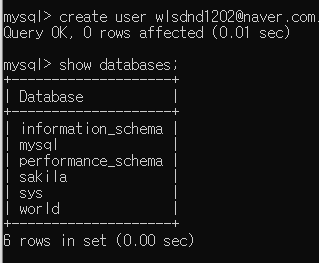
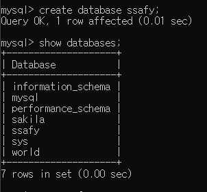
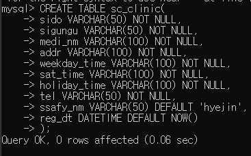
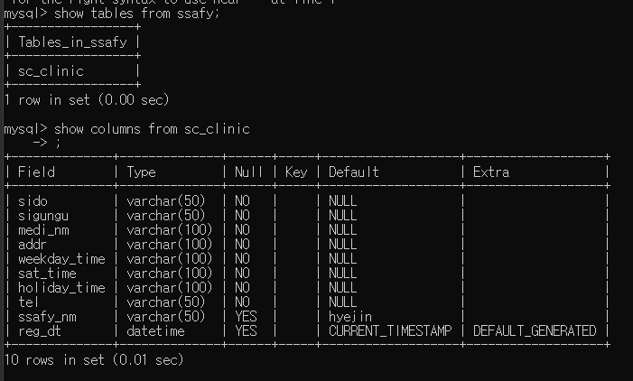
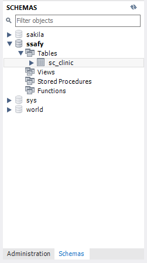
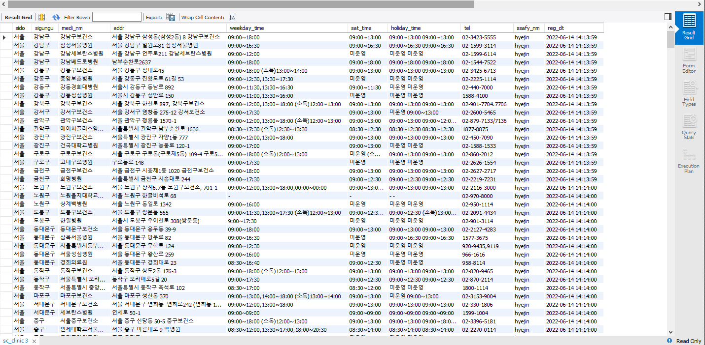
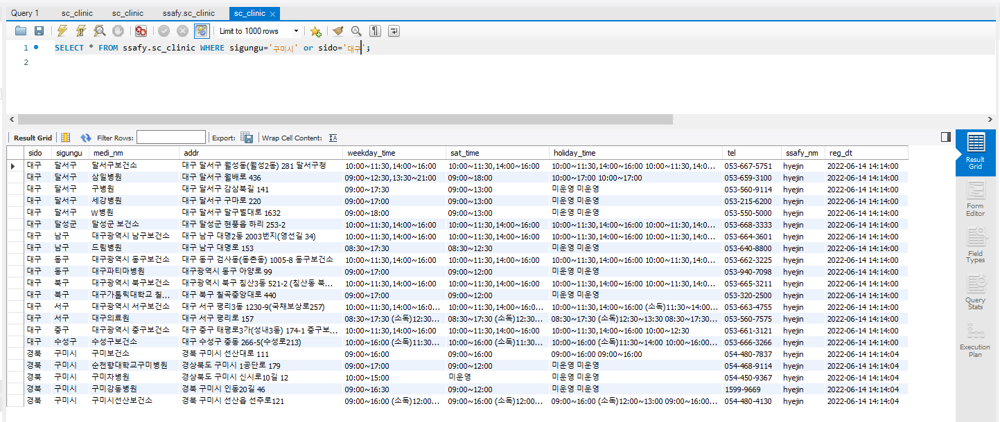
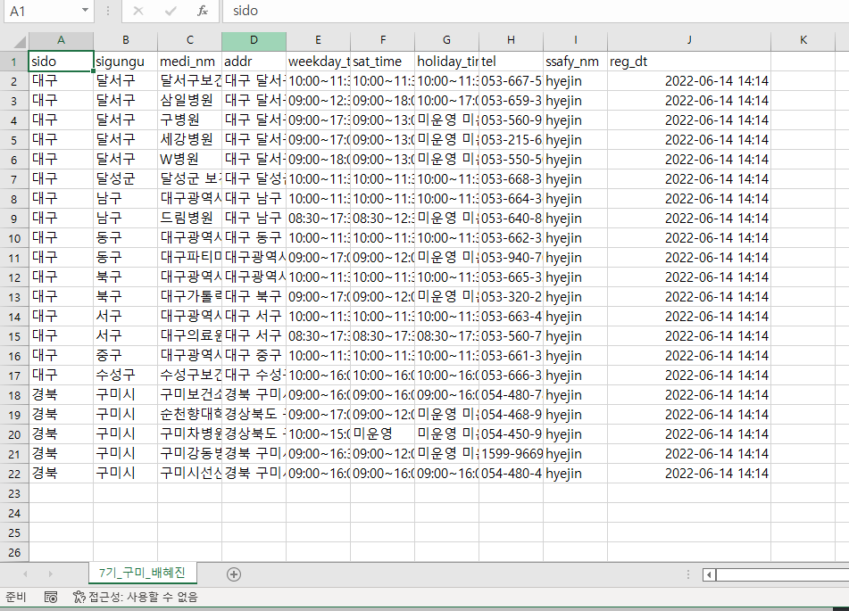

## DB데이터 적재 및 가공

__목표__

> '코로나19 선별 진료소' 데이터를 다운받아 필요한 컬럼들만 정제하여 로컬 DB에 적재
>
> 적재된 데이터를 원하는 형태로 가공하고 가공된 데이터를 Export

__과정__

1. 사용 프로그램 : Mysql

2. MySQL Command Line Client로 스키마 생성

   1. create user

   

   2. create database ssafy

   

      3. CREATE TABLE

         use ssafy; 실행 후 table 생성

   

​				table 생성 결과	

3. 데이터(엑셀) 다운로드 후 테이블 컬럼 대상에 맞게 가공 후 CSV로 저장
4. Workbench실행 후 Schemas에서 생성된 테이블 확인

5. Table Data Import Wizard를 실행하여 CSV 파일 Import

6. query를 이용하여 원하는 데이터 추출 후 Export

__결과__

> 기본과제 폴더 -> CSV파일 저장

