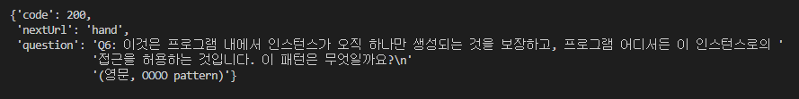
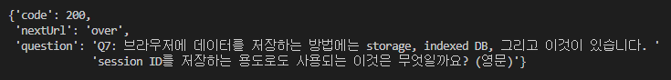
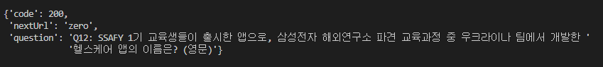

## Rest 통신을 이용한 문제풀이 - 싸피 스무고개

__풀이 과정__

1. REST 통신 모듈 구현 및 요청

   - 사용 언어 : Python

   - 사용 프로그램 : VScode

   - 코드

     - 처음 응답을 받는 부분에서 많이 헤맸다. 
     - 처음엔 리턴값을 request.get(url).json()으로 받으려 하였으나 get을 지원하지 않아 405에러가 떴다. 
     - 따라서 아래와 같이 요청 자체를 data에 할당하여 json으로 출력해보니 응답이 정상적으로 왔다.

     ```python
     import requests
     from pprint import pprint
     
     url = "http://13.125.222.176/quiz/alpha"
     data = requests.post(url, json={
         "nickname" : "구미3반배혜진",
         "yourAnswer" : "hellossafy",
     })
     print()
     pprint(data.json())
     ```

   

2. 응답 형식 확인 및 결과

   - 산출물

   

   > dfs

   

   

   > SSAFYcial

   


> protocol


> json




>singleton




> cookie


> redis


> MVVM


> pandas


> bluetooth




> fittymon


> Memoization


> IoC(Inversion of Control), 제어 반전


> Docker


> dfs


> bloom


> A


> quick


> Kubernetes


